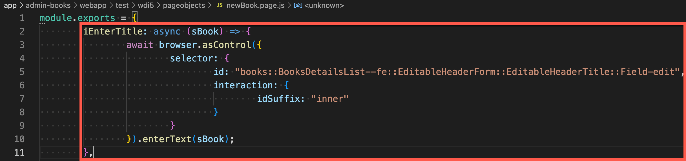
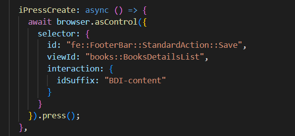
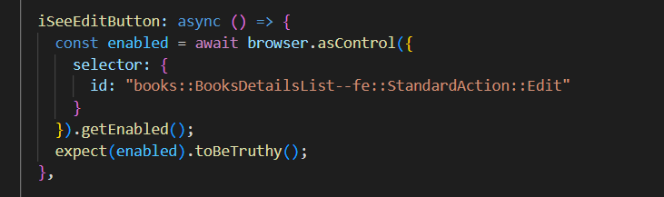
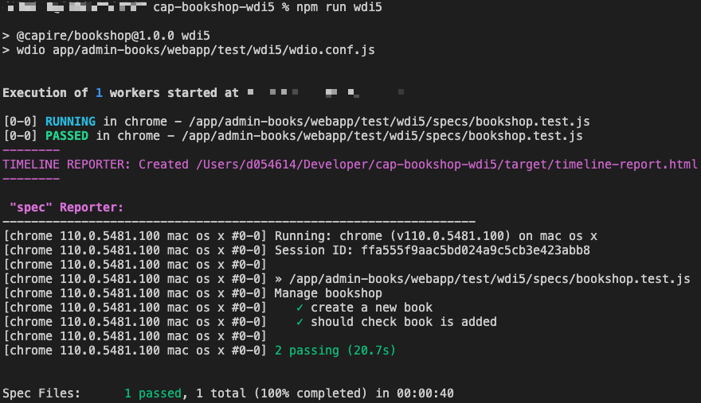

## Prerequisites
- You use [SAPUI5](https://sapui5.hana.ondemand.com/) in version 1.105.0 or higher.
- You have installed and configured a local Git client.
- You have installed [Node.js](https://nodejs.org/en/) in version 14.x or higher.
- You have installed [Visual Studio Code](https://code.visualstudio.com/).
- You have installed the `cds` development kit using the following command:
    ```
    npm install -g @sap/cds-dk
    ```
    If you encounter any problems when installing the `cds` development kit, have a look at [this troubleshooting section](https://cap.cloud.sap/docs/advanced/troubleshooting#npm-installation).
- Your Google Chrome version is up to date. See [Update Google Chrome](https://support.google.com/chrome/answer/95414?co=GENIE.Platform%3DDesktop&hl=en).

## Details
### You will learn
- How to create system tests with wdi5 using the UI5 Test Recorder for CAP-based projects on SAP Business Technology Platform
- How to create a CI/CD pipeline with project "Piper" (Q3/2022) - TODO: Group Page
- How to add system tests as automated steps to your CI/CD pipeline (Q3/2022) - TODO: Group Page

### What Is This Tutorial About?

In this tutorial, you'll create and run automated system tests with wdi5 against a simple CAP-based sample application. Your sample application is a bookshop, which has basic functions for managing books such as creating and deleting books.

The tutorial consists of three main stages:


1. Clone the CAP-based sample application and manually go through your test scenario before starting to code it.

2. Create and run system tests with wdi5 that add a new book to your bookshop and check if it's displayed in the list.

3. Automate your system tests by integrating them into a CI/CD pipeline. (Q3/2022) - TODO(Laura): Group Page

### About System Tests with wdi5

[wdi5](https://github.com/ui5-community/wdi5) is an open-source JavaScript testing framework for SAPUI5 applications. It drives a real browser for your deployed app and simulates authentic user scenarios. System tests check both front-end and back-end and make sure that all pieces of an application work well together.

The following graphic shows the positioning of system tests with wdi5 compared to other testing methods and tools. The arrow shape illustrates the granularity of the methods: Compared to unit, component, or integration tests, system tests examine less details and focus on crucial workflows, instead.

 TODO(Laura): Update images

>For more information about testing with wdi5, have a look at these blogs and presentations:

- [the king is dead – long live the king: wdi5 as UIVeri5 successor](https://blogs.sap.com/2022/02/12/the-king-is-dead-long-live-the-king-wdi5-as-uiveri5-successor/)
- [the ecosystem evolving around wdi5](https://blogs.sap.com/2022/08/30/the-ecosystem-evolving-around-wdi5/)
- [Testing UI5 Apps with wdi5 - Zero to Hero to Continuous Integration](https://www.youtube.com/watch?v=f-0ztSnb2-c)

### About the SAPUI5 Test Recorder

The SAPUI5 Test Recorder is a tool that helps you create integration and system tests. You can use it in any SAPUI5 application to inspect its user interface, view the control properties, and get code snippets for OPA5 and wdi5 tests. As of version 1.74, it is part of the SAPUI5 framework and since version 1.105 there is a wdi5-specific dialect included.

> For more information about the SAPUI5 Test Recorder, see [Test Recorder](https://sapui5.hana.ondemand.com/#/topic/2535ef9272064cb6bd6b44e5402d531d).

### About CI/CD with Project "Piper" (Q3/2022) => TODO(Laura)

Project "Piper" is one of SAP's solutions for continuous integration and delivery. It provides pre-configured Jenkins pipelines, which you can use in your own Jenkins master infrastructure and adapt according your needs. Project "Piper" consists of two different parts:

- A [shared library](https://sap.github.io/jenkins-library/), which contains the description of steps, scenarios, and utilities that are required to use Jenkins pipelines
- A [set of Docker images](https://github.com/SAP/devops-docker-images) that can be used to implement best practice processes

> For more information about SAP solutions for CI/CD, see:

> - [Continuous Integration and Delivery by SAP](https://help.sap.com/viewer/product/CICD_OVERVIEW/Cloud/en-US?task=discover_task)
> - [SAP Solutions for Continuous Integration and Delivery](https://help.sap.com/viewer/8cacec64ed854b2a88e9a0973e0f97a2/Cloud/en-US/e9fa320181124fa9808d4446a1bf69dd.html)

---

[ACCORDION-BEGIN [Step 1: ](Set up and run your CAP-based sample application)]

In Visual Studio Code, set up and run your bookshop application.

1. Before you start working, fork the [Repository](https://github.com/SAP-samples/cap-bookshop-wdi5) to your personal github account. Here you find documentation on how to [fork GitHub repositories](https://docs.github.com/en/get-started/quickstart/fork-a-repo#forking-a-repository).
2. In Visual Studio Code, choose **View** **→** **Command Palette…** **→** **Git:Clone**.
3. As **Repository URL**, enter:
    ```URL
    https://github.com/<your github username>/SAP-samples/cap-bookshop-wdi5.git
    ```
4. Choose **Select Repository Location** and select a folder into which to clone the test repository.

5. When asked if you would like to open the cloned repository, choose **Open**.

    As a result, the project `CAP-BOOKSHOP-WDI5` is loaded into the **EXPLORER** pane and you can see its resources in the outline:

     => TODO update image

6. In Visual Studio Code, choose **Terminal** **→** **New Terminal**.

    

7. Use the following command to install the npm packages:

    ```Shell/Bash
    npm install
    ```

8. To start your bookshop application, execute the following commands:

    ```Shell/Bash
    npm run fiori
    ```

    The console output should look as follows:

     => TODO Update image

9. Open a new Terminal, for that choose **Terminal** **→** **New Terminal**

10. Use the command `npm init wdio ./fiori/app/admin-books/webapp/test/wdi5/` to call the guided installation of WebdriverIO. Answer the questions as follows:
    | Question | Answer |
    | ----------- | ----------- |
    | Where is my automation backend located? | On my local machine |
    | Which framework do you want to use? | mocha |
    | Do you want to use a compiler? | No! |
    | Where are your test specs located? | ./specs/*.js |
    | Do you want WebdriverIO to autogenerate some test files? | N or no |
    | Which reporter do you want to use? | spec, timeline (select them via SPACE) |
    | Do you want to add a plugin to your test setup? | No Plugin (ENTER) |
    | Do you want to add a service to your test setup? | chromedriver, ui5 (select them via SPACE) |
    | What is the base url? | http://localhost:4004 |
    | Do you want me to run npm install | Y or yes |
    
11. In your project in the **EXPLORER** pane, choose **`fiori`** **→** **`app`** **→** **`admin-books`** **→** **`webapp`** **→** **`test`** **→** **`wdi5`**.

12. Now you can see all the files through which you can define system tests with wdi5:

     - TODO: Update image

    >The `target\report` folder is created with the first test execution.


    - (a) The `wdio.conf.js` file:

         In this file, you can define the settings for wdio and the wdi5 plugin. Examples are the browser and reporter that are used and the URL to access the Fiori app under test.

    - (b) The `test.js` file (in this case, it's called `bookshop.test.js`):

         In this file, you'll define your test scenario, which comprises steps that are triggered one after the other. Within the test scenario, you'll refer to your page objects.

    - (c) Page objects (in this case, you have `pageobjects/manageBooks.page.js` for the list of books that are added and the button to create a new book, and `pageobjects/newBook.page.js`  to provide the details of the new book):

        Page objects are design patterns that represent a significant part of an app, for example, a view. They group two kinds of elements:

           - Actions, for example, choosing the **Create** button to create a new book
           - Assertions, for example, checking if the newly created book is displayed in the list of books

         Page objects use locators to identify specific elements on the screen. Thereby, they allow test runners to see and do anything a real user would. Page objects reside in the `pageobjects` folder of your project.


13. Open the created `wdio.conf.js` file and add the following snippet under `exports.config` to configure wdi5 correctly:

    ```JavaScript
    wdi5: {
        logLevel: "error",
        url: "fiori-apps.html#Books-manage",
    },
    ```

14. Add following snippets to configure the timeline reporter correctly in the `wdio.conf.js`:

    ```JavaScript
    const { TimelineService } = require("wdio-timeline-reporter/timeline-service");
    exports.config = {
    // ...
    ```

    ```JavaScript
    // ...
    services: ['chromedriver','ui5', [TimelineService]],
    // ...
    ```

    ```JavaScript
    // ...
    reporters: ['spec',[
        "timeline",
        {
            outputDir: "target",
            embedImages: true,
            screenshotStrategy: "before:click",
        },
        ]
    ],
    // ...
    ```

15. Now, your project setup is ready. Make sure that your code looks as follows and choose **File** **→** **Save**.

     - TODO: Update image Simon


[VALIDATE_6]x
[ACCORDION-END]

[ACCORDION-BEGIN [Step 2: ](Walk through the test scenario)]

Manually, familiarize yourself with your test scenario before starting to code it. Later, you'll automate the following steps so that they are automatically executed during your system tests.

1. As your bookshop application runs on your local server, use the following URL to access the bookshop it:

    ```URL
    http://localhost:4004/fiori-apps.html#Books-manage
    ```

2. Choose **Create**:

    ! => TODO Update image

3. Enter the title of your new book, for example, *How to Cook Pancakes*:

    ! => TODO Update image

4. From the **Genre** drop-down menu, choose **Fiction**.

5. From the **Author** drop-down menu, choose **Emile Bronte**.

6. Choose **Create**.

7. Verify that the **Edit** button is displayed:

    !

8. Choose **Back** to return to the list of books.

9. Verify that the new book has been added to the list.


[DONE]
[ACCORDION-END]


[ACCORDION-BEGIN [Step 3: ](Create a wdi5 script for adding a new book)]

Create a wdi5 script to test the creation of a new book in your bookshop application.

1. In your project in the **EXPLORER** pane, choose **`fiori`** **→** **`app`** **→** **`admin-books`** **→** **`webapp`** **→** **`test`** **→** **`wdi5`** **→** **`specs/bookshop.test.js`**.

    The `bookshop.test.js` file contains your test scripts, which are divided into two sections:

    - The describe block, which is like a test suite and holds sets of test cases that are called *it*
    - The it block, which comprises the test cases

    You can have multiple *it* blocks in a single spec file.

    In your `bookshop.test.js` file, you'll define the steps of your test scenario and within them, refer to your page objects.

2. Implement the `it` function by adding the skeleton of the *create new book* test:

    ```JavaScript
    it("create a new book", async () => {

    });
    ```

    Your code should now look as follows:

     - TODO: Update image

3. As a first step to create a new book, you have to choose the **Create** button. Implement this action as follows in the *it* block:

    ```JavaScript
    await ManageBooksPage.iClickOnCreateNewBook();
    ```

    Here, `iClickOnCreateNewBook()` is a reference to the test function that you'll define in the following.

    Your code should now look as follows:

     - TODO: Update

    After each step make sure to save changes by choosing **File** **→** **Save**.

4. From the **EXPLORER** pane, open `pageobjects` **→** `manageBooks.page.js`.

    This file represents the page object for your bookshop application. In page objects, you can define actions that are performed during a test and make assertions:

     - TODO: Update

5. In the bookshop application in Google Chrome, press **CTRL** + **SHIFT** + **ALT** + **T** (if you use a Windows system) or **SHIFT** + **CTRL** + **OPTION** + **T** (if you use a Mac system) to open the Test Recorder in a new browser window.

6. In your sample application, right-click on the **Create Button** and choose **Press**.

    As a result, the Test Recorder highlights the entry to indicate its activity:

    ! => TODO Update image

    Now, the Test Recorder provides a code snippet for your test:

    ! - TODO: Update with selection of wdi5 as dialect

    Please make sure that the dialect *wdi5* is selected.

7. Copy the generated code snippet into the `module.exports` section of your `manageBooks.page.js` and name the function `iClickOnCreateNewBook`.

     - TODO: update image

[DONE]
[ACCORDION-END]

[ACCORDION-BEGIN [Step 4: ](Create a wdi5 script for adding detailed information to your book)]

Create a wdi5 script to test the addition of detailed information to your newly created book.

1. From the **EXPLORER** pane in Visual Studio Code, open `bookshop.test.js`.

2. In the describe block, add the following line to declare the variable `bookTitle` and assign the value "How to Cook Pancakes" to it:

    ``` JavaScript
    const bookTitle = "How to Cook Pancakes";
    ```

2. When adding detailed information to a book in the bookshop application, as a first action, you have to enter the title of the book. Implement this action as follows in the *it* block:

    ``` JavaScript
    await NewBookPage.iEnterTitle(bookTitle);
    ```

    The `bookTitle` constant, which you have declared before, is passed as an argument, here.

    Now, your code should look as follows:

     - TODO: Update Image

4. From the **EXPLORER** pane, open `pageobjects` **→** `newBook.page.js`.

5. In your bookshop application, right-click the **Title** input field and choose **Enter Text**.

    As a result, the Test Recorder highlights the input field to indicate its activity:

    ! => Update image

    Now, the Test Recorder provides a code snippet for your test:

    ! - TODO: Update image

    Please make sure that the dialect *wdi5* is selected.

6. Copy this code snippet into the `module.exports` section of your `newBook.page.js` and name the function `iEnterTitle`.

    Here, pass the `sTitle` as an argument in the function name and use it in the `enterText()` method.

     - TODO: Update image

7. In the *it* block of your `bookshop.spec.js`, add the following line to choose a value from the **Genre** drop-down list:

    ``` JavaScript
    await NewBookPage.iSelectGenre();
    ```
8. In your bookshop application, right-click the **Genre** drop-down menu and choose **Press**.

    As a result, the Test Recorder highlights the drop-down icon to indicate its activity:

    ! => Update image

    Now, the Test Recorder provides a code snippet for your test:

    ! - TODO: Update image

    Please make sure that the dialect *wdi5* is selected.

9. Copy this code snippet into the `module.exports` section of your `newBook.page.js` and name the function `iSelectGenre`.

10. From the **Genre** pop-up window in your bookshop application, right-click **Fiction** and choose **Press**.

11. Again, the Test Recorder provides a code snippet for your test. Copy it into the `module.exports` section of your `newBook.page.js` under the same function name (`iSelectGenre`).

12. In the **Genre** pop-up window in your bookshop application, right-click **OK** and choose **Press**.

13. Again, copy the generated code snippet from the Test Recorder into the `module.exports` section of your `newBook.page.js` under the same function name (`iSelectGenre`).

    Your code should now look as follows:

     - TODO: Update image

14. In the *it* block of your `bookshop.test.js`, add the following line to choose a value from the **Author** drop-down list:

    ```JavaScript
    await NewBookPage.iSelectAuthor();
    ```

15. Repeat the procedure for selecting the author (that is, copying the generated code snippets from the Test Recorder for choosing the drop-down menu, **Emily Bronte** from the pop-up window, and the **OK** button in the pop-up window into your page object).

    In the end, the code in your `newBook.page.js` should look as follows:

     - TODO: Update image

16. Now, in the overview window of your newly created book in the bookshop application, right-click the **Create** button and choose **Press**.

17. Copy the generated snippet into the `module.exports` section of your `newBook.page.js`:

     - TODO: Update image

18. To ensure that the save action was successful, verify that the **Edit** button is displayed. Add the expected behavior to your `bookshop.test.js`:

     - TODO: Update image

19. In the bookshop application, right-click the **Edit** button and choose **Highlight**.

20. On the right side of the Test Recorder window you find a section with Properties and Bindings. Click on the icon that is located on the left of the property *enabled*. This will `expect(enabled).toBeTruthy();` to the code snippet. => TODO: Add a screenshot / gif to visualize the click on the property. - Georg, Laura

21. Copy the generated code snippet from the Test Recorder into the `module.exports` section in your `newBook.page.js` and name the function `iSeeEditButton`. - TODO(Georg,Simon): Update and Remove the next step

    Your page object should now look as follows:

     - TODO: Update image

22. In the bookshop application, right-click the **<** *(back)* button and choose **Press**.

     => Update image

23. Implement the `it` function by adding the skeleton of the *should check book is added* test:

    ```JavaScript
    it("should check book is added", async () => {

    });
    ```

24. Again, copy the generated code snippet into the `module.exports` section of your `newBook.page.js` as action `iNavigateBack`.

    Your page object should now look as follows:

     - TODO: Update image

25. In your bookshop application, choose the **<** *(back)* button.

    As a result, you should see the list of all books, including the one you've added:

     => TODO: Update image

26. In your `newBook.page.js`, add this fact as an expected behavior:

    ```JavaScript
    await ManageBooksPage.theBookListContains(bookTitle);
    ```

    Now, your test is complete. Make sure that it looks as follows:

     - TODO: Update image

27. In the list of books of your bookshop application, right-click the title of the book you've created and choose **Highlight**. Make sure that only the specific Title of the row is blue highlighted and not the whole row.

     => TODO: Update image

28. On the right side of the Test Recorder window you find a section with Properties and Bindings. Click on the icon that is located on the left of the property *visible* in the *Inherited* section. This will add `expect(visible).toBeTruthy();` to the code snippet. => TODO: Add a screenshot / gif to visualize the click on the property. => TODO(Georg,Simon): Shall we use that as assertion

29. Copy the generated code snippet into the `module.exports` section of your `manageBooks.page.js` and name the function `theBookListContains`.

    Your page object should now look as follows:

     - TODO: Update image

30. Right-click your *test\wdi5* folder in the **EXPLORER** pane and choose **Open in Integrated Terminal**.

31. To run your test, execute the following command:

    ```Bash/Shell
    npm run wdio
    ```

    If your test run was successful, your terminal response should look as follows:

     - TODO: Update image

32. In the **EXPLORER** pane, right-click the `timeline-report.html` in the `target` folder and choose **Reveal in File Explorer**.

33. Double-click the `timeline-report` in the file explorer: - TODO: Update

     - TODO: Update image

[DONE]
[ACCORDION-END]

---

**Congratulations!**

You have successfully created different system tests with wdi5 for a CAP-based project.
