## Prerequisites
- You use [SAPUI5](https://sapui5.hana.ondemand.com/) in version 1.105.0 or higher.
- You have installed and configured a local Git client.
- You have installed [Node.js](https://nodejs.org/en/) in version 14.x or higher.
- You have installed [Visual Studio Code](https://code.visualstudio.com/).
- You have installed the `cds` development kit using the following command:
    ```
    npm install -g @sap/cds-dk
    ```
    If you encounter any problems when installing the `cds` development kit, have a look at [this troubleshooting section](https://cap.cloud.sap/docs/advanced/troubleshooting#npm-installation).
- Your Google Chrome version is up to date. See [Update Google Chrome](https://support.google.com/chrome/answer/95414?co=GENIE.Platform%3DDesktop&hl=en).
- You have an [SAP Business Technology Platform (BTP) Trial Account](https://developers.sap.com/tutorials/hcp-create-trial-account.html) with a subaccount hosted in the region "US East (VA)".
- You have an account on [GitHub](https://github.com/).

## Details
### You will learn
- How to create system tests with wdi5 using the UI5 Test Recorder for CAP-based projects on SAP Business Technology Platform
- How to create a CI/CD pipeline and add system tests as automated steps to your CI/CD pipeline

### What Is This Tutorial About?

In this tutorial, you'll create and run automated system tests with wdi5 against a simple CAP-based sample application. Your sample application is a bookshop, which has basic functions for managing books such as creating and deleting books.

The tutorial consists of three main stages:


1. Clone the CAP-based sample application and manually go through your test scenario before starting to code it.

2. Create and run system tests with wdi5 that add a new book to your bookshop and check if it's displayed in the list.

3. Automate your system tests by integrating them into a CI/CD pipeline.

### About System Tests with wdi5

[wdi5](https://github.com/ui5-community/wdi5) is an open-source JavaScript testing framework for SAPUI5 applications. It drives a real browser for your deployed app and simulates authentic user scenarios. System tests check both front-end and back-end and make sure that all pieces of an application work well together.

The following graphic shows the positioning of system tests with wdi5 compared to other testing methods and tools. The arrow shape illustrates the granularity of the methods: Compared to unit, component, or integration tests, system tests examine less details and focus on crucial workflows, instead.

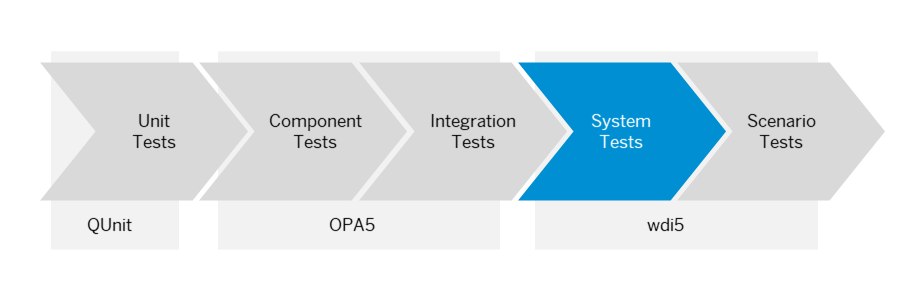

>For more information about testing with wdi5, have a look at these blogs and presentations:

- [the king is dead – long live the king: wdi5 as UIVeri5 successor](https://blogs.sap.com/2022/02/12/the-king-is-dead-long-live-the-king-wdi5-as-uiveri5-successor/)
- [the ecosystem evolving around wdi5](https://blogs.sap.com/2022/08/30/the-ecosystem-evolving-around-wdi5/)
- [Testing UI5 Apps with wdi5 - Zero to Hero to Continuous Integration](https://www.youtube.com/watch?v=f-0ztSnb2-c)

### About the SAPUI5 Test Recorder

The SAPUI5 Test Recorder is a tool that helps you create integration and system tests. You can use it in any SAPUI5 application to inspect its user interface, view the control properties, and get code snippets for OPA5 and wdi5 tests. As of version 1.74, it is part of the SAPUI5 framework and since version 1.105 there is a wdi5-specific dialect included.

> For more information about the SAPUI5 Test Recorder, see [Test Recorder](https://sapui5.hana.ondemand.com/#/topic/2535ef9272064cb6bd6b44e5402d531d).

### About SAP Continuous Integration and Delivery

SAP Continuous Integration and Delivery is a service on SAP Business Technology Platform, which lets you configure and run predefined continuous integration and delivery pipelines that build, test, and deploy your code changes.
It provides an easy, UI-guided way to set up the service and configure and run your pipelines, without hosting your own Jenkins instance. See [What Is SAP Continuous Integration and Delivery?](https://help.sap.com/docs/CONTINUOUS_DELIVERY/99c72101f7ee40d0b2deb4df72ba1ad3/618ca03fdca24e56924cc87cfbb7673a.html?version=Cloud).

> For more information about SAP solutions for CI/CD, see [SAP Solutions for Continuous Integration and Delivery](https://help.sap.com/docs/CICD_OVERVIEW/8cacec64ed854b2a88e9a0973e0f97a2/e9fa320181124fa9808d4446a1bf69dd.html?language=en-US) and [Continuous Integration and Delivery by SAP](https://help.sap.com/docs/CICD_OVERVIEW).

---

[ACCORDION-BEGIN [Step 1: ](Set up and run your CAP-based sample application)]

In Visual Studio Code, set up and run your bookshop application.

1. Before you start working, fork [this repository](https://github.com/SAP-samples/cap-bookshop-wdi5) to your personal github account. Here you find documentation on how to [fork GitHub repositories](https://docs.github.com/en/get-started/quickstart/fork-a-repo#forking-a-repository).
2. In Visual Studio Code, choose **View** **→** **Command Palette…** **→** **Git:Clone**.
3. As **Repository URL**, enter:
    ```URL
    https://github.com/<your github username>/cap-bookshop-wdi5.git
    ```
4. Choose **Select Repository Location** and select a folder into which to clone the test repository.

5. When asked if you would like to open the cloned repository, choose **Open**.

    As a result, the project `CAP-BOOKSHOP-WDI5` is loaded into the **EXPLORER** pane and you can see its resources in the outline:

    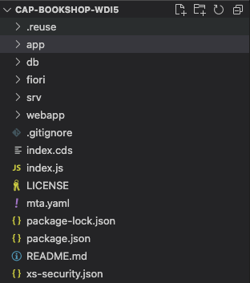

6. In Visual Studio Code, choose **Terminal** **→** **New Terminal**.

    

7. Use the following command to install the npm packages:

    ```Shell/Bash
    npm install
    ```

8. To start your bookshop application, execute the following command:

    ```Shell/Bash
    npm run start
    ```

9. Open a new Terminal, for that choose **Terminal** **→** **New Terminal**

10. To call the quickstart installation of wdi5 use the following command:

    ```Shell/Bash
    npm init wdi5@latest -- --configPath ./app/admin-books/webapp/test/wdi5/ --specs ./**/wdi5/specs/**.js --baseUrl http://localhost:4004/fiori-apps.html\#Books-manage
    ```

    The console output should look as follows:

    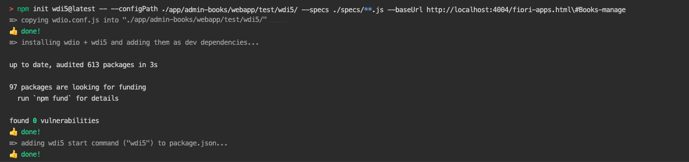

11. In your project in the **EXPLORER** pane, choose **`app`** **→** **`admin-books`** **→** **`webapp`** **→** **`test`** **→** **`wdi5`**.

12. Now you can see all the files through which you can define system tests with wdi5:

    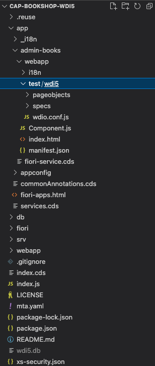

    - (a) The `wdio.conf.js` file:

         In this file, you can define the settings for wdio and the wdi5 plugin. Examples are the browser and reporter that are used and the URL to access the Fiori app under test.

    - (b) The `test.js` file (in this case, it's called `bookshop.test.js`):

         In this file, you'll define your test scenario, which comprises steps that are triggered one after the other. Within the test scenario, you'll refer to your page objects.

    - (c) Page objects (in this case, you have `pageobjects/manageBooks.page.js` for the list of books that are added and the button to create a new book, and `pageobjects/newBook.page.js`  to provide the details of the new book):

        Page objects are design patterns that represent a significant part of an app, for example, a view. They group two kinds of elements:

           - Actions, for example, choosing the **Create** button to create a new book
           - Assertions, for example, checking if the newly created book is displayed in the list of books

         Page objects use locators to identify specific elements on the screen. Thereby, they allow test runners to see and do anything a real user would. Page objects reside in the `pageobjects` folder of your project.

13. Use the command `npm install --save-dev wdio-timeline-reporter` to install the timeline reporter

    The console ouput should look as follows:

    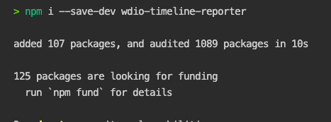

14. Add following snippets to configure the timeline reporter and the chrome browser correctly in the `wdio.conf.js`:

    ```JavaScript
    const { TimelineService } = require("wdio-timeline-reporter/timeline-service");
    exports.config = {
    // ...
    ```

    ```JavaScript
    // ...
    services: ['chromedriver','ui5', [TimelineService]],
    // ...
    ```

    ```JavaScript
    // ...
    reporters: ['spec',[
        "timeline",
        {
            outputDir: "target",
            embedImages: true,
            screenshotStrategy: "before:click",
        },
        ]
    ],
    // ...
    ```

    ```JavaScript
    // ...
    capabilities: [{
        maxInstances: 5,
        browserName: 'chrome',
        acceptInsecureCerts: true,
        "goog:chromeOptions": {
            args: ["--no-sandbox", "--disable-dev-shm-usage"]
        }
    }],
    // ...
    ```

15. Now, your project setup is ready. Make sure that your code looks as follows and choose **File** **→** **Save**.

    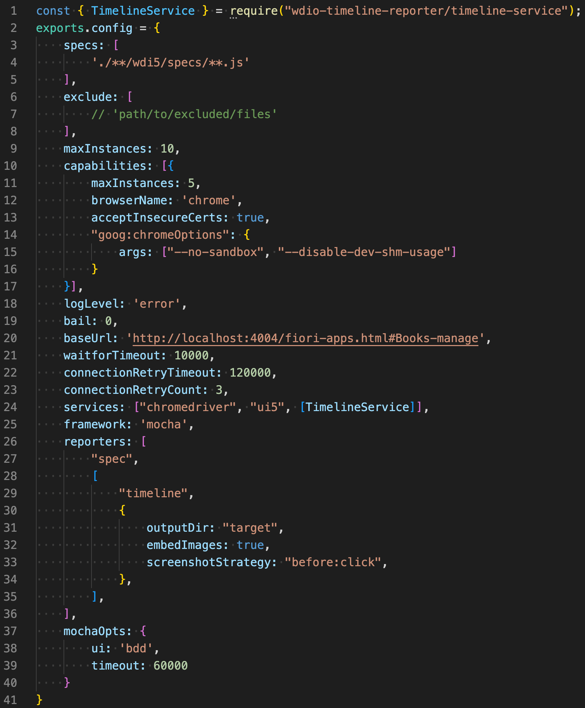


[VALIDATE_6]x
[ACCORDION-END]

[ACCORDION-BEGIN [Step 2: ](Walk through the test scenario)]

Familiarize yourself with your test scenario before starting to code it. Later, you'll automate the following steps so that they are automatically executed during your system tests.

1. As your bookshop application runs on your local server, use the following URL to access the bookshop it:

    ```URL
    http://localhost:4004/fiori-apps.html#Books-manage
    ```

2. Choose **Create**:

    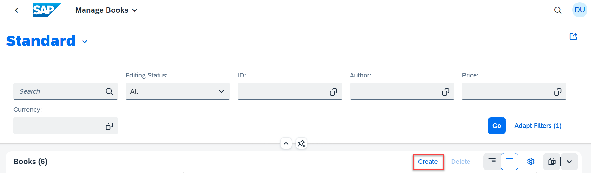

3. Enter the title of your new book, for example, *How to Cook Pancakes*:

4. From the **Genre** drop-down menu, choose **Fiction**.

5. From the **Author** drop-down menu, choose **Emile Bronte**.

    

6. Choose **Create**.

7. Verify that the **Edit** button is displayed.

8. Choose **Back** to return to the list of books.

9. Verify that the new book has been added to the list.

    [New book in the list](NewBook.png)

10. The created book will persist as long as the local server with the application is running. To start with a fresh database we have to stop the process and restart it again with `npm run start`
[DONE]
[ACCORDION-END]


[ACCORDION-BEGIN [Step 3: ](Create a wdi5 script for adding a new book)]

Create a wdi5 script to test the creation of a new book in your bookshop application.

1. In your project in the **EXPLORER** pane, choose **`fiori`** **→** **`app`** **→** **`admin-books`** **→** **`webapp`** **→** **`test`** **→** **`wdi5`** **→** **`specs/bookshop.test.js`**.

    The `bookshop.test.js` file contains your test scripts, which are divided into two sections:

    - The describe block, which is like a test suite and holds sets of test cases that are called *it*
    - The it block, which comprises the test cases

    You can have multiple *it* blocks in a single spec file.

    In your `bookshop.test.js` file, you'll define the steps of your test scenario and within them, refer to your page objects.

2. Into the `describe` funcion, implement the `it` function by adding the skeleton of the *create new book* test:

    ```JavaScript
    it("create a new book", async () => {

    });
    ```

    Your code should now look as follows:

    

3. As a first step to create a new book, you have to choose the **Create** button. Implement this action as follows in the *it* block:

    ```JavaScript
    await ManageBooksPage.iClickOnCreateNewBook();
    ```

    Here, `iClickOnCreateNewBook()` is a reference to the test function that you'll define in the following.

    Your code should now look as follows:

    

    After each step make sure to save changes by choosing **File** **→** **Save**.

4. From the **EXPLORER** pane, open `pageobjects` **→** `manageBooks.page.js`.

    This file represents the page object for your bookshop application. In page objects, you can define actions that are performed during a test and make assertions:

    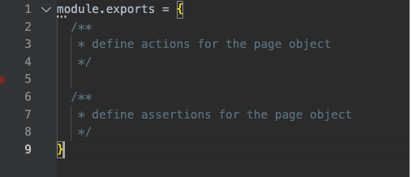

5. In the bookshop application in Google Chrome, press **CTRL** + **SHIFT** + **ALT** + **T** (if you use a Windows system) or **SHIFT** + **CTRL** + **OPTION** + **T** (if you use a Mac system) to open the Test Recorder in a new browser window.

6. In your sample application, right-click on the **Create Button** and choose **Press**.

    As a result, the Test Recorder highlights the entry to indicate its activity:

    

    Now, the Test Recorder provides a code snippet for your test:

    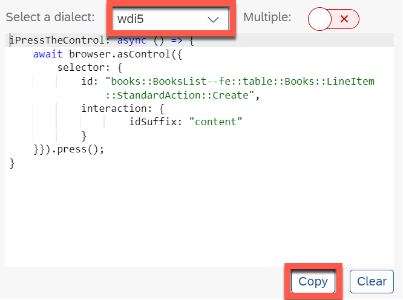

    Please make sure that the dialect *wdi5* is selected.

7. Copy the generated code snippet into the `module.exports` section of your `manageBooks.page.js` and name the function `iClickOnCreateNewBook`.

    

[DONE]
[ACCORDION-END]

[ACCORDION-BEGIN [Step 4: ](Create a wdi5 script for adding detailed information to your book)]

Create a wdi5 script to test the addition of detailed information to your newly created book.

1. From the **EXPLORER** pane in Visual Studio Code, open `bookshop.test.js`.

2. In the describe block, add the following line to declare the variable `bookTitle` and assign the value "How to Cook Pancakes" to it:

    ``` JavaScript
    const bookTitle = "How to Cook Pancakes";
    ```

3. When adding detailed information to a book in the bookshop application, as a first action, you have to enter the title of the book. Implement this action as follows in the *it* block:

    ``` JavaScript
    await NewBookPage.iEnterTitle(bookTitle);
    ```

    The `bookTitle` constant, which you have declared before, is passed as an argument, here.

    Now, your code should look as follows:

    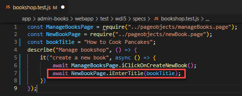

4. From the **EXPLORER** pane, open `pageobjects` **→** `newBook.page.js`.

5. In your bookshop application, right-click the **Title** input field and choose **Enter Text**.

    As a result, the Test Recorder highlights the input field to indicate its activity:

    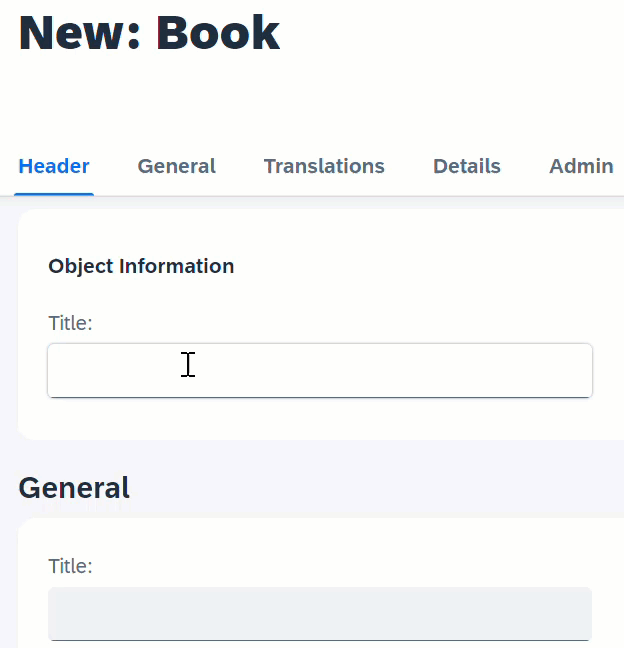

    Now, the Test Recorder provides a code snippet for your test:

    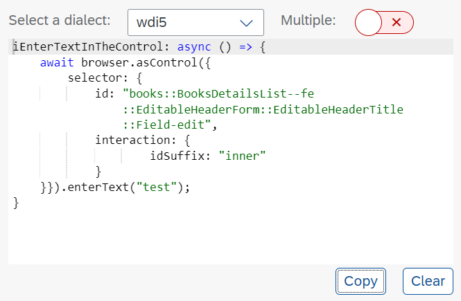

    Please make sure that the dialect *wdi5* is selected.

6. Copy this code snippet into the `module.exports` section of your `newBook.page.js` and name the function `iEnterTitle`.

    Here, pass the `sBook` as an argument in the function name and use it in the `enterText()` method.

    

7. In the *it* block of your `bookshop.test.js`, add the following line to choose a value from the **Genre** drop-down list:

    ``` JavaScript
    await NewBookPage.iSelectGenre();
    ```

    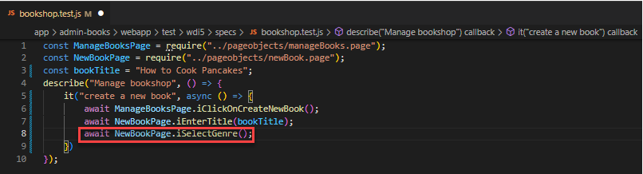

8. In your bookshop application, right-click the **Genre** drop-down menu and choose **Press**.

    As a result, the Test Recorder highlights the drop-down icon to indicate its activity:

    

    Now, the Test Recorder provides a code snippet for your test:

    

    Please make sure that the dialect *wdi5* is selected.

9. Copy this code snippet into the `module.exports` section of your `newBook.page.js` and name the function `iSelectGenre`.

    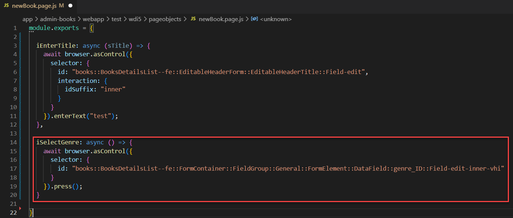

10. From the **Genre** pop-up window in your bookshop application, right-click **Fiction** and choose **Press**.

11. Again, the Test Recorder provides a code snippet for your test. Copy it into the `module.exports` section of your `newBook.page.js` under the same function name (`iSelectGenre`).

    Your code should now look as follows:

    

12. In the *it* block of your `bookshop.test.js`, add the following line to choose a value from the **Author** drop-down list:

    ```JavaScript
    await NewBookPage.iSelectAuthor();
    ```

13. Repeat the procedure for selecting the author (that is, copying the generated code snippets from the Test Recorder for choosing the drop-down menu and **Emily Bronte** from the pop-up window into your page object). Name the funcions `iSelectAuthor`.

    In the end, the code in your `newBook.page.js` should look as follows:

    

14. In the *it* block of your `bookshop.test.js`, add the following line to select the create button at the bottom of the application:

    ```JavaScript
    await NewBookPage.iPressCreate();
    await NewBookPage.iSeeEditButton()
    ```

15. Now, at the footer in the bookshop application, right-click the **Create** button and choose **Press**.

16. Copy the generated snippet into the `module.exports` section of your `newBook.page.js`. Name the funcions `iPressCreate` and add the expected behavior to your `bookshop.test.js`.

    

17. To ensure that the save action was successful, verify that the **Edit** button is displayed. Add the expected behavior to your `bookshop.test.js`:

    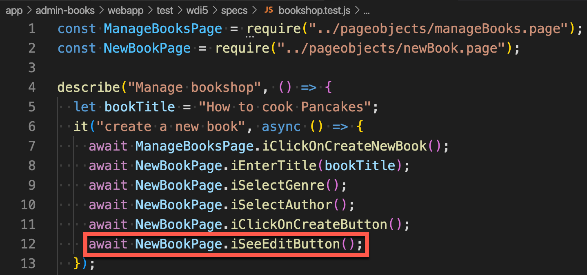

18. In the bookshop application, right-click the **Edit** button and choose **Highlight**.

19. On the right side of the Test Recorder window you find a section with Properties and Bindings. Choose the icon that is located on the left of the property *enabled*. This will add `expect(enabled).toBeTruthy();` to the code snippet.

    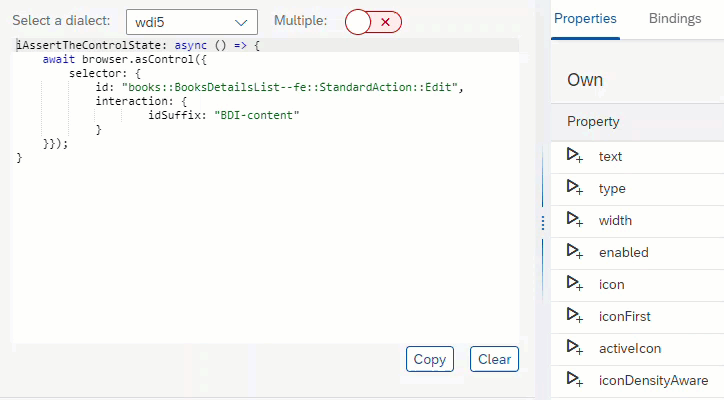

20. Copy the generated code snippet from the Test Recorder into the `module.exports` section in your `newBook.page.js` and name the function `iSeeEditButton`.

    It should look as follows:

    

21. Let's proceed with our test scenario by implementing another `it` function in the `bookshop.test.js` file. To achieve that we need to add the skeleton of the *should check book is added* test function:

    ```JavaScript
    it("should check book is added", async () => {

    });
    ```

22. In this `it` function we need two steps. First an action to navigate back to the list of books and a second step to assert that our newly created book is contained in the list. Implement this as follows in the *it* block:

    ```JavaScript
    await NewBookPage.iNavigateBack();
    await ManageBooksPage.theBookListContains(bookTitle);
    ```

    Now, your test is complete. Make sure that it looks as follows:
    

23. To get the code-snippet for the implementation of the `NewBookPage.iNavigateBack` action, right-click the **<** *(Go Back)* button and choose **Press** in the bookshop application.

    

24. Again, copy the generated code snippet into the `module.exports` section of your `newBook.page.js` and name it `iNavigateBack`.

    Your page object should now look as follows:

    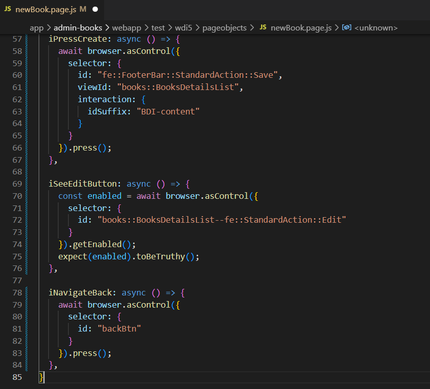

25. In your bookshop application, choose the **<** *(back)* button.

    As a result, you should see the list of all books, including the one you've added.

26. In the list of books of your bookshop application, right-click the title of the book you've created and choose **Highlight**. Make sure that only the specific Title of the row is blue highlighted and not the whole row.

27. On the right side of the Test Recorder window you find a section with Properties and Bindings. Choose the icon that is located on the left of the property *visible* in the *Inherited* section. This will add `expect(visible).toBeTruthy();` to the code snippet.

    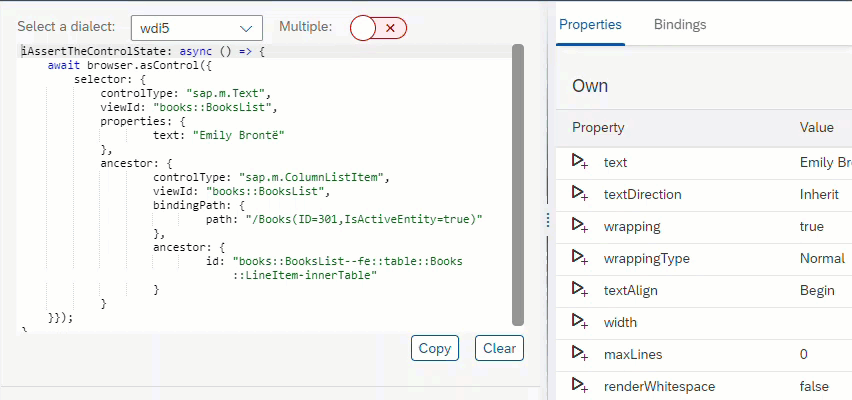

28. Copy the generated code snippet into the `module.exports` section of your `manageBooks.page.js` and name the function `theBookListContains`. Here, pass the `sBook` as an argument in the function name and use it in the locator to identify the control by its text.

    It look as follows:

    

Choose **File** **→** **Save**.

29. Right-click your *test\wdi5* folder in the **EXPLORER** pane and choose **Open in Integrated Terminal**.

30. To run your test, execute the following command:

    ```Bash/Shell
    npm run wdi5
    ```

    If your test run was successful, your terminal response should look as follows:

    

    > Note:
    >
    >- In case you are facing timeout error as shown below:
    >
     >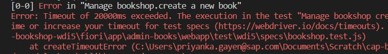
     >
     >The timeout property is applicable at each step definition. However, if you want to increase the timeout because your test takes longer than the default value, then you need to set it in the mocha framework options. In the wdio.conf.js set the time as shown below:
    >
    >            ``` JavaScript
    >            // wdio.conf.js
    >            exports.config = {
    >                //.....
    >                mochaOpts: {
    >                   ui: 'bdd',
    >                   timeout: 60000
    >                }
    >                //.....
    >            }
    >            ```

    >- Another known timeout error is while waiting for the ui5 controller to wait as shown below:

    > 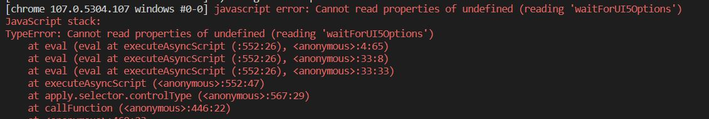
    >
    >If you are getting timeout errors while waiting for an UI5 element to load or be visible, then consider increasing the maximum waiting time for the availability of UI5 control. In the wdio.conf.js set the time as shown below:
    >
    >           ``` JavaScript
    >           /// wdio.conf.js
    >           exports.config = {
    >               //.....
    >               wdi5: {
    >                   waitForUI5Timeout: 60000,
    >               },
    >               //.....
    >           }
    >           ```

    >- Another timeout we have to increase when we increase the `waitForUI5Timeout` and/or the `mochaOpts` timeout higher than 30 seconds is the session script timeout. In the wdio.conf.js set the time as shown below:
    >
    >           ``` JavaScript
    >           /// wdio.conf.js
    >           exports.config = {
    >               //.....
    >               before: function (capabilities, spec) {
    >                   browser.setTimeout({ 'script': 60000 })
    >               },
    >               //.....
    >           }
    >           ````


31. In the **EXPLORER** pane, right-click the `timeline-report.html` in the `target` folder and choose **Reveal in File Explorer**.

32. Double-click the `timeline-report` in the file explorer:

    

[DONE]
[ACCORDION-END]

[ACCORDION-BEGIN [Step 5: ](Set Up SAP Continuous Integration and Delivery)]

Enable SAP Continuous Integration and Delivery, add the required permissions for it, and access the service.

1. Go to your SAP BTP cockpit and choose **Go To Your Trial Account**:

    [https://cockpit.hanatrial.ondemand.com/](https://cockpit.hanatrial.ondemand.com/)


1. In your subaccount in the SAP BTP cockpit, choose **Services** → **Service Marketplace**.

2. In the **Extension Suite – Development Efficiency** category, choose **Continuous Integration & Delivery**.

    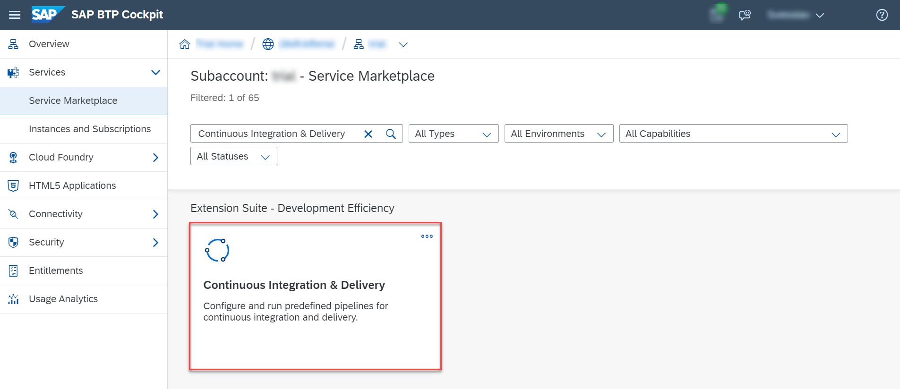

3. In the **New Instance or Subscription** pop-up, leave the default values and choose **Create**.

    > **Note:** If in the **Service Marketplace** in your subaccount, you didn't see the **Continuous Integration & Delivery** tile, you might need to add the required entitlements:
    > 1. From the navation pane, choose **Entitlements**.
    > 2. In the **Entitlements** overview of your subaccount, choose **Configure Entitlements**.
    > 3. Choose **Add Service Plans**.
    > 4. Search for **Continuous Integration & Delivery**.
    > 5. In the **Service Details: Continuous Integration & Delivery** pane, check the box next to **trial (Application)** and choose **Add 1 Service Plan**.
    > 6. Back in the **Entitlements** overview of your subaccount, choose **Save**.

4. From the navigation pane, choose  **Security** **&rarr;** **Users**.

    >If you use an enterprise account, you need to be a User & Role Administrator of your subaccount to view the  **Security** section. See [Managing Subaccounts Using the Cockpit](https://help.sap.com/viewer/65de2977205c403bbc107264b8eccf4b/Cloud/en-US/55d0b6d8b96846b8ae93b85194df0944.html).

5. Choose the name of your user.

6. From the **Role Collections** section, choose **Assign Role Collection**.

7. From the dropdown list, select **CICD Service Administrator** and **CICD Service Developer**. Confirm your choice with **Assign Role Collection**.

    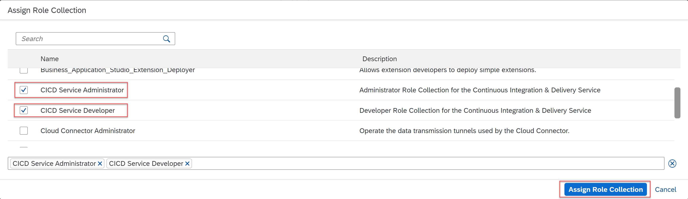

8. Navigate back to your subaccount overview and from the navigation pane, choose **Service Marketplace**.

9. In the **Extension Suite – Development Efficiency** category, choose **Continuous Integration & Delivery**.

10. Choose  *(Actions)* **&rarr;** **Go to Application**.

    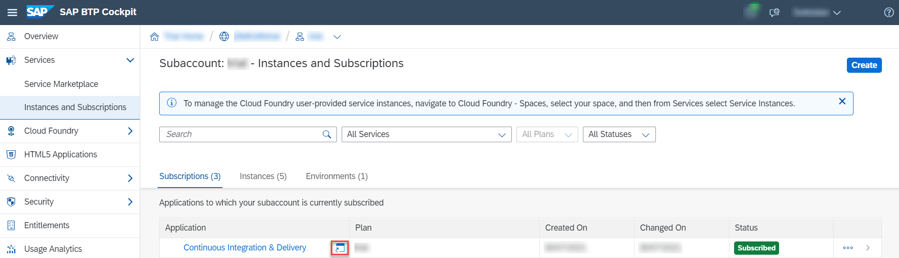

[DONE]
[ACCORDION-END]

[ACCORDION-BEGIN [Step 6: ](Configure your SAP BTP credentials)]

Create credentials for deploying your application to SAP BTP, Cloud Foundry environment.

1. In SAP Continuous Integration and Delivery, to the **Credentials** tab and choose **+** *(Create Credentials)*.

    

2. For **Name**, enter a freely chosen name for your credentials, which is unique in your SAP BTP subaccount, for example **`cfdeploy`**.

3. As **Type**, select **Basic Authentication**.

4. For **Username**, enter your username for the SAP BTP cockpit.

5. For **Password**, use your password for the SAP BTP cockpit.

    

6. Choose **Create**.

[DONE]
[ACCORDION-END]

[ACCORDION-BEGIN [Step 7: ](Configure your GitHub credentials)]

If your GitHub repository is not private, you can skip this section. If your GitHub repository is private, configure credentials for it, so that SAP Continuous Integration and Delivery service can connect to it.

1. In SAP Continuous Integration and Delivery, to the **Credentials** tab and choose **+** *(Create Credentials)*.

2. For **Name**, enter a freely chosen name for your credential, which is unique in your SAP BTP subaccount. In this example, the name of the credential is **`github`**.

3. As **Type**, select **Basic Authentication**.

4. For **Username**, enter your GitHub username.

5. For **Password**, use a [personal access token](https://docs.github.com/en/github/authenticating-to-github/keeping-your-account-and-data-secure/creating-a-personal-access-token).

    > Select **repo** as scope when creating the token.

6. Choose **Create**.

[DONE]
[ACCORDION-END]

[ACCORDION-BEGIN [Step 8: ](Add Your Repository to SAP Continuous Integration and Delivery)]

Connect SAP Continuous Integration and Delivery with the repository in which your project's sources reside.

1. In SAP Continuous Integration and Delivery, choose **Repositories** → **+** _(Add)_.

2. In the **Add Repository** pop-up, add a name for your repository.

3. In GitHub, copy the HTTPS clone URL of the repository containing the sample CAP application.

    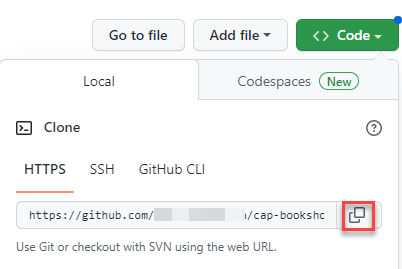

4. Paste it into the **Clone URL** field in the **Add Repository** pop-up in SAP Continuous Integration and Delivery.

5. Choose **Add**.

    >(Optional) You can automate CI/CD builds using GitHub webhooks. You can trigger a build by creating and commiting a code change in your GitHub project. For more information, see [Add a Webhook in GitHub](https://help.sap.com/docs/CONTINUOUS_DELIVERY/99c72101f7ee40d0b2deb4df72ba1ad3/090d4aaa9628426b91c90e8284213040.html).

[DONE]
[ACCORDION-END]

[ACCORDION-BEGIN [Step 9: ](Integrate your system tests into your CI/CD pipeline)]

 Configure a basic CI/CD job and automate your system tests by integrating them into a CI/CD pipeline.

1. Execute a Git commit and push the content of your local `CAP-BOOKSHOP-WDI5` project into your GitHub repository.

2. In SAP Continuous Integration and Delivery, go to the Jobs tab and choose **+** *(Create job)*.

3. In the **General Information** section of the Create Job pane, enter the following values:

|   Parameter  |  Value   |
| --- | --- |
|  Job Name	   |  Freely choose a unique name for your job, for example, `cap-bookshop-wdi5`.
  Repository |From the drop-down list, choose your repository.
|   Branch  |    Enter the branch of your repository for which you want to configure your CI/CD job, for example, `main`. |
|  Pipeline   |   	From the drop-down list, choose **SAP Cloud Application Programming Model**.  |
|  Version   | 	If you create a new job, the latest version is selected by default.    |
|   State  |    To enable your job, choose **ON**. |

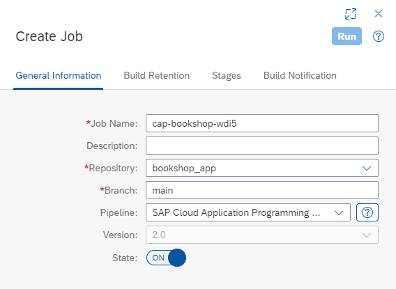

4.  In the  **Build Retention** section, keep the default values.

5. In the **Stages** section, choose **Job Editor** as Configuration Mode.

6. For the **Build** stage, keep the default values (for example, build tool `mta` and verison `Java 8 Node 14`).

7. For the **Acceptance** stage, enter the following values for the **Deploy to Cloud Foundry Space** step:

|   Parameter  |   Value  |
| --- | --- |
| Application Name | Enter a unique application name. |
|   API Endpoint  |   Enter the URL of your SAP BTP, Cloud Foundry API Endpoint. You can find it in the overview of your subaccount in the SAP BTP cockpit, under the **Cloud Foundry Environment** tab.  |
|    Org Name |  Enter the name of your Cloud Foundry organization. You can also find it in the overview of your subaccount.   |
|    Space | Enter the name of the Cloud Foundry space in which you want to test your application.    |
|    Credentials |    From the drop-down list, choose the SAP BTP credentials you created.  |

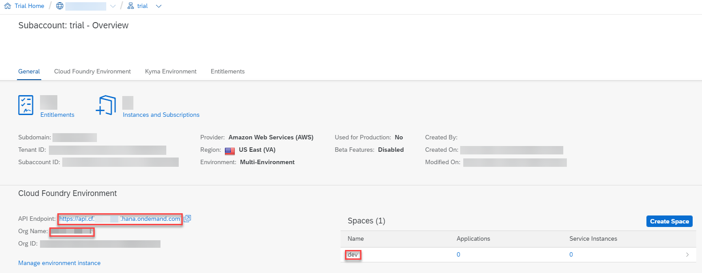

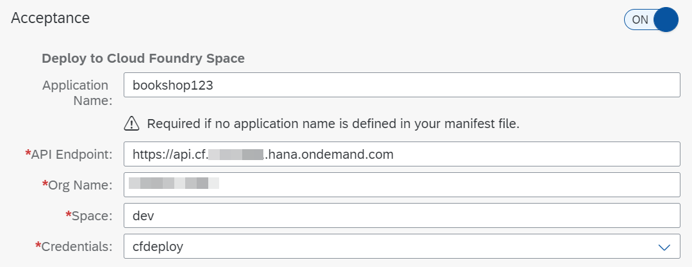

8. Enter the following values for the **WebdriverIO Test** step:

|   Parameter  |   Value  |
| --- | --- |
|   npm Script  |   Use the same script name that is used to execute for local execution of the tests (`wdi5`).  |
|    Base URL  |  Enter the URL of the application against which the tests shall be executed. The application will be available under the following URL: `https://<Org Name>-<Space>-bookshop-srv.cfapps.us10-001.hana.ondemand.com/fiori-apps.html#Books-manage`. Depending on your region `us10-001` could also differ.|
|    Space | Enter the name of the Cloud Foundry space in which you want to test your application.    |
|    Credentials |    As your test application doesn’t require credentials, leave this field empty. |

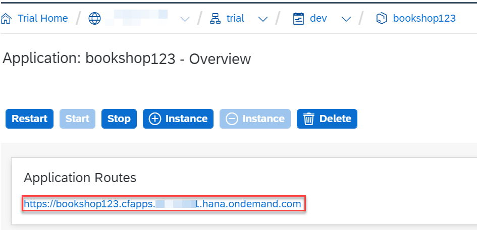

9. Switch all other stages off and choose **Create**.

> As this tutorial focuses on how to get started with SAP Continuous Integration and Delivery, we’ve decided to configure only a very basic CI/CD pipeline in it. For how to configure more elaborate ones, see Supported Pipelines.

10. To run your CI/CD pipeline, choose **Run**.

As a result, a build of the connected job is triggered and a new build tile appears in the **Builds** section of your job. If you choose it, the **Build Stages** view opens and you can watch the individual stages of your build run through. The pipeline run might take a few minutes.

You can get an overview of the test results in the detailed log of your build:

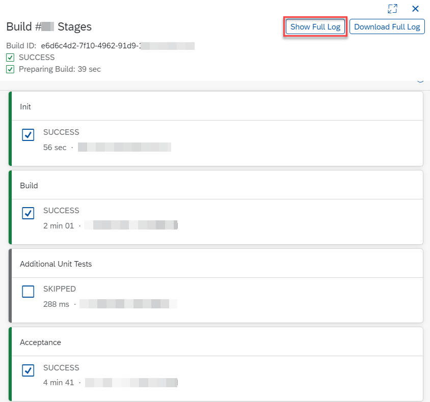


[DONE]
[ACCORDION-END]

---

**Congratulations!**

You have successfully created different system tests with wdi5 for a CAP-based project.
